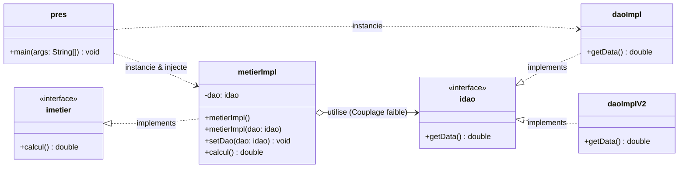

# Activité Pratique N°1 : Inversion de Contrôle (IoC) et Injection des Dépendances (DI)

Ce projet illustre la mise en œuvre des concepts fondamentaux d'architecture logicielle en Java : le **couplage faible**, le principe d'**inversion des dépendances (DIP)** et l'**injection des dépendances (DI)**.

---

## 🎯 Objectifs de l'activité

1. **Créer l'interface `idao`** comportant la méthode `double getData()`.
2. **Créer les implémentations de cette interface** :
   - `daoImpl` (simulation d'une source Base de données).
   - `daoImplV2` (simulation d'une source Web Service).
3. **Créer l'interface `imetier`** comportant la méthode `double calcul()`.
4. **Créer l'implémentation `metierImpl` en couplage faible** :
   - Dépendance vers l'interface `idao` (et non vers une classe concrète).
   - Prise en charge de l'injection par **constructeur** et par **setter**.
5. **Tester l'injection statique dans la classe `pres1`**.
6. **Documenter les résultats avec captures d'écran de l'exécution**.

---

## 📂 Structure du Projet

```text
Activite-Pratique-1-Injection-Dependances/
├── captures/
│   └── Resultat-injectionDependance-Statique.png   # Capture d'écran de l'exécution
├── pom.xml
└── src/
    └── main/
        └── java/
            └── ma.ilyas/
                ├── dao/
                │   ├── idao.java         # Interface du contrat d'accès aux données
                │   ├── daoImpl.java      # Implémentation V1 (Base de données)
                │   └── daoImplV2.java    # Implémentation V2 (Web service)
                ├── metier/
                │   ├── imetier.java      # Interface du contrat métier
                │   └── metierImpl.java   # Implémentation métier (couplage faible)
                └── pres/
                    └── pres.java         # Classe de test / présentation (instanciation et injection)
```

---

## 🏗️ Diagramme de Classes & Architecture

Le schéma ci-dessous met en évidence le **couplage faible** : la classe `metierImpl` est liée exclusivement à l'interface `idao`. Elle ignore totalement quelle implémentation concrète (`daoImpl` ou `daoImplV2`) sera injectée à l'exécution.



---

## 💻 Description et Code Source

### 1. Couche DAO (Accès aux Données) - Package `ma.ilyas.dao`

#### Interface `idao.java`
Définit le contrat d'accès aux données :
```java
package ma.ilyas.dao;

public interface idao {
    double getData();
}
```

#### Implémentation V1 : `daoImpl.java` (Base de Données)
```java
package ma.ilyas.dao;

public class daoImpl implements idao {
    // Par exemple version DataBase
    @Override
    public double getData() {
        System.out.println("Version de base de donnees");
        return 10;
    }
}
```

#### Implémentation V2 : `daoImplV2.java` (Web Service)
Permet de simuler une évolution ou une autre source de données sans impacter la couche métier :
```java
package ma.ilyas.dao;

public class daoImplV2 implements idao {
    // Par exemple version WebUI / Web Service
    @Override
    public double getData() {
        System.out.println("Version de web service");
        return 20;
    }
}
```

---

### 2. Couche Métier - Package `ma.ilyas.metier`

#### Interface `imetier.java`
Définit le contrat des opérations métier :
```java
package ma.ilyas.metier;

public interface imetier {
    double calcul();
}
```

#### Implémentation `metierImpl.java` (Couplage Faible)
Cette classe dépend uniquement de l'interface `idao`. Elle propose deux mécanismes pour injecter cette dépendance :
- Un constructeur par défaut et un mutateur `setDao(...)` (**Injection par Setter**).
- Un constructeur avec paramètre `metierImpl(idao dao)` (**Injection par Constructeur**).

```java
package ma.ilyas.metier;
import ma.ilyas.dao.idao;

public class metierImpl implements imetier {
    // Couplage faible : référence vers l'interface idao
    private idao dao;

    // Constructeur par défaut
    public metierImpl() {
        this.dao = null;
    }

    // Constructeur paramétré
    public metierImpl(idao dao) {
        this.dao = dao;
    }

    // Mutateur pour l'injection par Setter
    public void setDao(idao dao) {
        this.dao = dao;
    }

    @Override
    public double calcul() {
        double a = dao.getData();
        double resultat = a + 5;
        return resultat;
    }
}
```

---

### 3. Couche Présentation - Package `ma.ilyas.pres`

La classe `pres1` initialise les composants et réalise l'**injection de dépendances statique** :

```java
package ma.ilyas.pres;
import ma.ilyas.dao.daoImpl;
import ma.ilyas.metier.metierImpl;

public class pres {
    public void main(String args[]) {
        System.out.println(" ******** Activite-Pratique-1-Injection-Dependances ******** ");
        daoImpl a = new daoImpl();

        // Option 1 : Injection via constructeur avec paramètre
        // metierImpl b = new metierImpl(a);

        // Option 2 : Injection via Setter
        metierImpl b = new metierImpl();
        b.setDao(a);

        System.out.println(b.calcul());
    }
}
```

---

## 📸 Captures d'écran & Résultats d'Exécution

### Résultat de l'injection statique par Setter

Lors de l'exécution de la classe `pres1` avec l'implémentation `daoImpl` injectée dans `metierImpl` :
1. `daoImpl.getData()` affiche `"Version de base de donnees"` et retourne `10`.
2. `metierImpl.calcul()` calcule `10 + 5 = 15.0`.

#### Affichage Console :
```text
 ******** Activite-Pratique-1-Injection-Dependances ******** 
Version de base de donnees
15.0
```

#### Capture d'écran IntelliJ IDEA :


> **Démonstration du couplage faible :** Si l'on remplace `daoImpl a = new daoImpl();` par `daoImplV2 a = new daoImplV2();`, la méthode `calcul()` retourne `25.0` (`20 + 5`) en affichant `"Version de web service"`, sans modifier la moindre ligne dans `metierImpl`.

---

## 🔄 Comparaison des Approches d'Injection

| Approche | Description | Avantages |
|---|---|---|
| **Injection par Constructeur** (`new metierImpl(dao)`) | L'objet est instancié avec toutes ses dépendances dès sa création. | L'objet est toujours dans un état cohérent et prêt à l'emploi. |
| **Injection par Setter** (`b.setDao(dao)`) | L'objet est instancié puis la dépendance est injectée via la méthode `setDao`. | Permet de changer dynamiquement de dépendance au cours du cycle de vie de l'objet. |
| **Injection Dynamique** (par Réflexion / Fichier de configuration) | Chargement des classes avec `Class.forName()` et instanciation dynamique. | Respect total du principe Open/Closed (OCP) : modification de l'implémentation sans recompilation. |
| **Injection avec Framework (Spring)** | Gestion automatique du cycle de vie et des dépendances par le conteneur IoC (XML ou Annotations `@Autowired`). | Suppression complète du code d'assemblage manuel. |

---

## 🛠️ Compilation et Exécution

### Prérequis
- Java JDK 17+ (ou compatible)
- Apache Maven

### Commandes Maven
```bash
# Compilation du projet
mvn clean compile

# Packaging
mvn package
```
