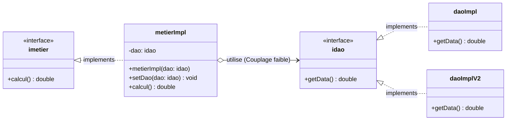

# Activité Pratique N°1 : Inversion de Contrôle (IoC) et Injection des Dépendances (DI)

Ce projet illustre les concepts fondamentaux du génie logiciel : le **couplage faible**, le principe d'**inversion des dépendances (DIP - SOLID)** et l'**injection de dépendances (DI)** en Java.

---

## 🎯 Objectifs de l'activité

1. **Créer l'interface `IDao`** avec une méthode `getData()`.
2. **Créer une implémentation de cette interface** (`daoImpl`, `daoImplV2`).
3. **Créer l'interface `IMetier`** avec une méthode `calcul()`.
4. **Créer une implémentation de cette interface en utilisant le couplage faible** (`metierImpl`).

---

## 📂 Structure du Projet

```text
src/main/java/
├── dao/
│   ├── idao.java         # Interface définissant le contrat d'accès aux données
│   ├── daoImpl.java      # Première implémentation (ex: version Base de Données)
│   └── daoImplV2.java    # Deuxième implémentation (ex: version Web/Capteur)
├── metier/
│   ├── imetier.java      # Interface définissant le contrat des traitements métier
│   └── metierImpl.java   # Implémentation du métier en couplage faible avec idao
└── pres/
    └── pres.java         # Classe de présentation / démarrage de l'application
```

---

## 🏗️ Architecture & Diagramme de Classes

Le schéma ci-dessous illustre le principe du **couplage faible** : la classe `metierImpl` dépend uniquement de l'interface `idao` et non pas d'une implémentation concrète (`daoImpl` ou `daoImplV2`).



---

## 📝 Détail des Étapes Réalisées

### 1. Interface `IDao` (`idao.java`)
L'interface définit le contrat d'accès aux données sans imposer la manière dont elles sont récupérées (base de données, service web, fichier, etc.).

```java
package dao;

public interface idao {
    double getData();
}
```

---

### 2. Implémentations de `IDao` (`daoImpl.java` & `daoImplV2.java`)
Ces classes fournissent des implémentations concrètes de l'interface `idao`.

- **`daoImpl`** (simulation d'une source type Base de Données) :
  ```java
  package dao;

  public class daoImpl implements idao {
      @Override
      public double getData() {
          return 10;
      }
  }
  ```

- **`daoImplV2`** (simulation d'une autre source, ex. capteur ou API) :
  ```java
  package dao;

  public class daoImplV2 implements idao {
      @Override
      public double getData() {
          return 20;
      }
  }
  ```

Grâce à l'abstraction `idao`, l'application peut basculer d'une implémentation à une autre sans modifier une seule ligne du code métier.

---

### 3. Interface `IMetier` (`imetier.java`)
L'interface métier expose les règles et traitements fonctionnels de l'application.

```java
package metier;

public interface imetier {
    double calcul();
}
```

---

### 4. Implémentation Métier avec Couplage Faible (`metierImpl.java`)
La classe `metierImpl` implémente `imetier` et applique le **couplage faible** en déclarant une référence vers l'interface `idao` :

```java
package metier;
import dao.idao;

public class metierImpl implements imetier {
    // Couplage faible : référence vers l'interface et NON une classe concrète
    private idao dao;

    // Injection via le constructeur
    public metierImpl(idao dao){
        this.dao = dao;
    }

    // Injection via le setter
    public void setDao(idao dao){
        this.dao = dao;
    }

    @Override
    public double calcul() {
        double a = dao.getData();
        double resultat = a + 5;
        return resultat;
    }
}
```

#### Points clés du Couplage Faible :
- **Attribut privé de type interface** : `private idao dao;` évite tout lien direct avec une classe concrète (`new daoImpl()`).
- **Injection par constructeur & setter** : Permet à un composant externe (ou framework IoC) d'injecter l'implémentation souhaitée au moment de l'exécution.
- **Testabilité** : Il devient très simple de créer un mock de `idao` pour tester unitairement `metierImpl`.

---

## ⚙️ Modes d'Injection des Dépendances

Dans la couche de présentation (`pres.java`), l'injection de dépendances peut se faire de plusieurs manières :

### A. Injection Statique (Par instanciation directe)
Instanciation manuelle et injection via constructeur ou setter :
```java
idao dao = new daoImpl(); // ou new daoImplV2()
metierImpl metier = new metierImpl(dao);
System.out.println("Résultat = " + metier.calcul());
```

### B. Injection Dynamique (Par réflexion)
Permet de rendre l'application totalement fermée à la modification et ouverte à l'extension (Open/Closed Principle) à l'aide d'un fichier de configuration (`config.txt`) :
```java
Scanner scanner = new Scanner(new File("config.txt"));
String daoClassName = scanner.nextLine();
Class<?> cDao = Class.forName(daoClassName);
idao dao = (idao) cDao.getDeclaredConstructor().newInstance();

String metierClassName = scanner.nextLine();
Class<?> cMetier = Class.forName(metierClassName);
imetier metier = (imetier) cMetier.getDeclaredConstructor(idao.class).newInstance(dao);

System.out.println("Résultat = " + metier.calcul());
```

### C. Injection avec le Framework Spring
- **Via XML** : utilisation de balises `<bean>` et `<property>` / `<constructor-arg>`.
- **Via Annotations** : utilisation de `@Component`, `@Repository`, `@Service` et `@Autowired`.

---

## 🚀 Prérequis et Compilation

- **JDK** : Version 17+ (ou version configurée dans le `pom.xml`)
- **Maven** : 3.8+

### Compilation :
```bash
mvn clean compile
```

---

## 🏆 Bénéfices de cette Conception

| Critère | Couplage Fort | Couplage Faible (Ce projet) |
|---|---|---|
| **Interchangeabilité** | Difficile, nécessite de modifier le code | Immédiate, par configuration ou injection |
| **Tests Unitaires** | Complexes, dépendances réelles requises | Faciles, utilisation de mocks |
| **Maintenabilité** | Faible (effet domino lors des changements) | Élevée, composants modulaires et indépendants |
| **Respect SOLID** | Viole le DIP (Dependency Inversion) | Respecte les principes DIP et OCP |
