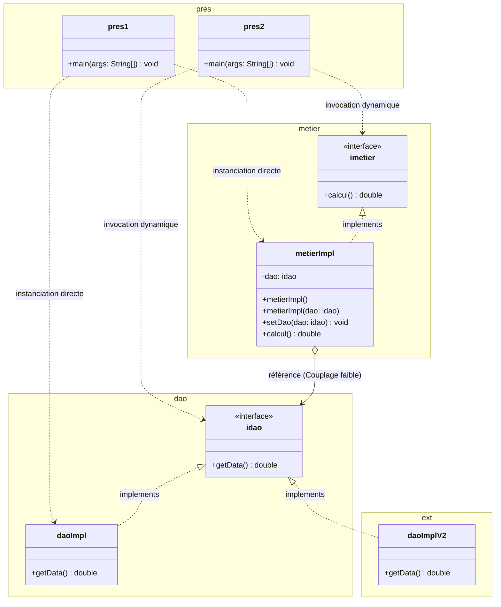
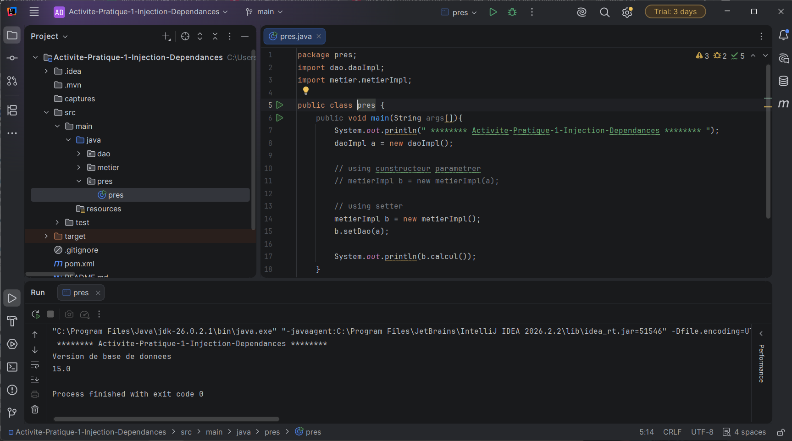
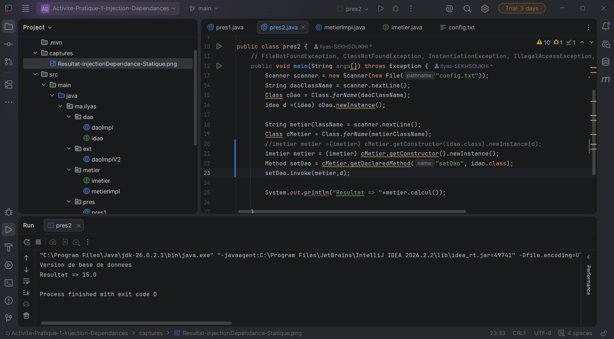

# Activité Pratique N°1 : Inversion de Contrôle (IoC) et Injection des Dépendances (DI)

Ce projet illustre la mise en œuvre des concepts fondamentaux d'architecture logicielle en Java : le **couplage faible**, le principe d'**inversion des dépendances (DIP)** et l'**injection des dépendances (DI)** sous ses deux formes : **statique** (instanciation directe) et **dynamique** (API Réflexion et fichier de configuration).

---

## 🎯 Objectifs de l'activité

1. **Conception des interfaces** :
   - `idao` comportant la méthode `double getData()`.
   - `imetier` comportant la méthode `double calcul()`.
2. **Implémentations de l'accès aux données (DAO)** :
   - `daoImpl` (simulation d'une source Base de données, valeur retournée : `10`).
   - `daoImplV2` (simulation d'une source Web Service, valeur retournée : `20`).
3. **Implémentation de la logique métier (`metierImpl`) en couplage faible** :
   - Dépendance exclusive vers l'interface `idao` (sans référence aux classes concrètes).
   - Injection par **constructeur** et par **setter**.
4. **Injection statique des dépendances (`pres1`)** :
   - Instanciation manuelle et assemblage par le code source.
5. **Injection dynamique des dépendances (`pres2`)** :
   - Lecture des noms des classes depuis le fichier `config.txt`.
   - Chargement dynamique et instanciation via l'API **Reflection** (`Class.forName()`, `newInstance()`, `Method.invoke()`).
   - Respect strict du principe **Open/Closed Principle (OCP)**.
6. **Documentation et validation visuelle** :
   - Intégration des captures d'écran attestant de la bonne exécution des tests.

---

## 📂 Structure du Projet

```text
Activite-Pratique-1-Injection-Dependances/
├── captures/
│   ├── Resultat-injectionDependance-Statique.png    # Capture de l'exécution de l'injection statique
│   └── Resultat-injectionDependance-Dynamique.png   # Capture de l'exécution de l'injection dynamique
├── config.txt                                      # Fichier de configuration pour l'injection dynamique
├── pom.xml                                         # Configuration Maven du projet
└── src/
    └── main/
        └── java/
            └── ma.ilyas/
                ├── dao/
                │   ├── idao.java                   # Interface du contrat d'accès aux données
                │   └── daoImpl.java                # Implémentation DAO V1 (Base de données)
                ├── ext/
                │   └── daoImplV2.java              # Implémentation DAO V2 (Web service)
                ├── metier/
                │   ├── imetier.java                # Interface du contrat métier
                │   └── metierImpl.java             # Implémentation métier (couplage faible)
                └── pres/
                    ├── pres1.java                  # Test de l'injection de dépendances statique
                    └── pres2.java                  # Test de l'injection de dépendances dynamique
```

---

## 🏗️ Diagramme de Classes & Architecture

Le diagramme met en évidence le **couplage faible** : la classe `metierImpl` dépend uniquement de l'interface `idao`. Elle ignore totalement quelle implémentation concrète (`daoImpl` ou `daoImplV2`) lui est injectée à l'exécution.



---

## 💻 Description et Code Source

### 1. Couche DAO (Accès aux Données)

#### Interface `idao.java` (`ma.ilyas.dao`)
Définit le contrat d'accès aux données :
```java
package ma.ilyas.dao;

public interface idao {
    double getData();
}
```

#### Implémentation V1 : `daoImpl.java` (`ma.ilyas.dao` - Base de Données)
```java
package ma.ilyas.dao;

public class daoImpl implements idao {
    // Par exemple version DataBase
    @Override
    public double getData() {
        System.out.println("Version de base de donnees");
        return 10;
    }
}
```

#### Implémentation V2 : `daoImplV2.java` (`ma.ilyas.ext` - Web Service)
Permet d'étendre l'application avec une nouvelle source de données sans toucher au code existant :
```java
package ma.ilyas.ext;
import ma.ilyas.dao.idao;

public class daoImplV2 implements idao {
    // Par exemple version WebUI
    @Override
    public double getData() {
        System.out.println("Version de web service");
        return 20;
    }
}
```

---

### 2. Couche Métier

#### Interface `imetier.java` (`ma.ilyas.metier`)
Définit le contrat des opérations métier :
```java
package ma.ilyas.metier;

public interface imetier {
    double calcul();
}
```

#### Implémentation : `metierImpl.java` (`ma.ilyas.metier` - Couplage Faible)
Cette classe dépend uniquement de l'interface `idao` et propose deux façons d'injecter la dépendance :
- Par constructeur paramétré (`metierImpl(idao dao)`).
- Par accesseur / mutateur (`setDao(idao dao)`).

```java
package ma.ilyas.metier;
import ma.ilyas.dao.idao;

public class metierImpl implements imetier {
    private idao dao;

    public metierImpl() {}

    public metierImpl(idao dao) { // constructeur paramétré
        this.dao = dao;
    }

    public void setDao(idao dao) { // setter
        this.dao = dao;
    }

    @Override
    public double calcul() {
        double a = dao.getData();
        double resultat = a + 5;
        return resultat;
    }
}
```

---

### 3. Fichier de Configuration (`config.txt`)

Ce fichier texte contient les noms qualifiés complets des classes concrètes à instancier dynamiquement :

```text
ma.ilyas.dao.daoImpl
ma.ilyas.metier.metierImpl
```

> **Flexibilité :** Pour basculer vers l'implémentation Web Service (`daoImplV2`), il suffit de remplacer la première ligne par `ma.ilyas.ext.daoImplV2`, **sans recompiler ni modifier une seule ligne de code**.

---

### 4. Couche Présentation / Exécution

#### A. Injection Statique : `pres1.java` (`ma.ilyas.pres`)
Instanciation directe (`new`) et injection explicite via setter ou constructeur :

```java
package ma.ilyas.pres;
import ma.ilyas.dao.daoImpl;
import ma.ilyas.ext.daoImplV2;
import ma.ilyas.metier.metierImpl;

public class pres1 {
    public void main(String args[]){
        System.out.println(" ******** Activite-Pratique-1-Injection-Dependances ******** ");
        daoImpl a = new daoImpl();

        // Option 1 : Injection par constructeur paramétré
        // metierImpl b = new metierImpl(a);

        // Option 2 : Injection par Setter
        metierImpl b = new metierImpl();
        b.setDao(a);

        System.out.println(b.calcul());
    }
}
```

#### B. Injection Dynamique : `pres2.java` (`ma.ilyas.pres`)
Utilisation du fichier de configuration `config.txt` et de l'API Reflection de Java pour instancier et injecter les composants dynamiquement au runtime :

```java
package ma.ilyas.pres;
import ma.ilyas.dao.idao;
import ma.ilyas.metier.imetier;
import java.io.File;
import java.lang.reflect.Method;
import java.util.Scanner;

public class pres2 {
    public void main(String args[]) throws Exception {
        // Lecture du fichier de configuration
        Scanner scanner = new Scanner(new File("config.txt"));

        // 1. Instanciation dynamique du DAO
        String daoClassName = scanner.nextLine();
        Class cDao = Class.forName(daoClassName);
        idao d = (idao) cDao.newInstance();

        // 2. Instanciation dynamique du Métier
        String metierClassName = scanner.nextLine();
        Class cMetier = Class.forName(metierClassName);
        imetier metier = (imetier) cMetier.getConstructor().newInstance();

        // 3. Injection dynamique de la dépendance via le Setter
        Method setDao = cMetier.getDeclaredMethod("setDao", idao.class);
        setDao.invoke(metier, d);

        // 4. Appel de la méthode métier
        System.out.println("Resultat => " + metier.calcul());
    }
}
```

---

## 📸 Captures d'écran & Résultats d'Exécution

### 1. Résultat de l'Injection Statique (`pres1`)

Lors de l'exécution de la classe `pres1` avec l'implémentation `daoImpl` injectée dans `metierImpl` via setter :
- `daoImpl.getData()` affiche `"Version de base de donnees"` et retourne `10`.
- `metierImpl.calcul()` calcule `10 + 5 = 15.0`.

#### Résultat Console :
```text
 ******** Activite-Pratique-1-Injection-Dependances ******** 
Version de base de donnees
15.0

Process finished with exit code 0
```

#### Capture d'écran IntelliJ IDEA :


---

### 2. Résultat de l'Injection Dynamique (`pres2`)

Lors de l'exécution de la classe `pres2` avec configuration par `config.txt` (`daoImpl` et `metierImpl`) :
- Lecture dynamique du fichier `config.txt`.
- Chargement des classes avec `Class.forName()`.
- Instanciation et invocation de `setDao` par réflexion (`Method.invoke()`).
- Calcul final retourné : `15.0`.

#### Résultat Console :
```text
Version de base de donnees
Resultat => 15.0

Process finished with exit code 0
```

#### Capture d'écran IntelliJ IDEA :

*(Fichier source : `captures/Resultat-injectionDependance-Dynamique.png`)*



---

## 🔄 Comparatif des Approches

| Caractéristique | Injection Statique (`pres1`) | Injection Dynamique (`pres2`) | Avec Conteneur IoC (Spring) |
|---|---|---|---|
| **Mécanisme** | Opérateur `new` explicite | API Réflexion (`Class.forName`, `Method.invoke`) | Annotations (`@Autowired`) ou XML |
| **Couplage** | Couplage fort dans la classe de test/présentation | Couplage faible total | Couplage faible total |
| **Fermeture à la modification** | Nécessite modification et recompilation du code | Aucune modification du code compilé (fermé à la modif.) | Aucune modification du code compilé |
| **Ouverture à l'extension** | Limitée | Forte (ajout de nouvelles classes dans `config.txt`) | Maximale (gestion complète du cycle de vie des beans) |
| **Principe respecté** | Inversion de contrôle basique | Respect complet du principe OCP (Open/Closed Principle) | Inversion de Contrôle (IoC) & Injection des dépendances (DI) automatisée |

---

## 🛠️ Compilation et Exécution

### Prérequis
- Java JDK 8+ (testé avec JDK 17 / JDK 26)
- Apache Maven

### Commandes Maven
```bash
# Compiler le projet
mvn clean compile

# Packager le projet (générer le JAR)
mvn clean package
```
